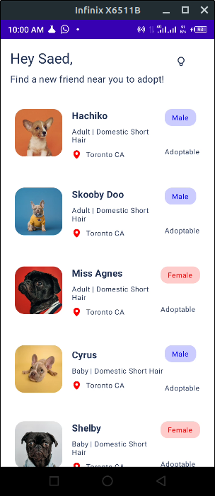
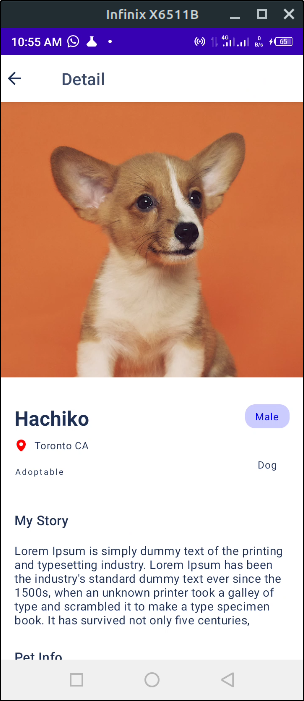

# Jet Pet Resque

## Description

Jet Pet Rescue App is a cutting-edge repository that serves as a comprehensive and interactive learning resource for developers interested in mastering Jetpack Compose, Retrofit, and the seamless integration of the Coil image loading library.

In this repository, you will find a well-structured and beginner-friendly project that showcases the power of Jetpack Compose, Google's modern UI toolkit for Android development. Jetpack Compose allows you to build delightful, intuitive, and dynamic user interfaces with minimal code, and the Jet Pet Rescue App leverages its full potential to create a visually stunning and smooth user experience.

One of the key features of this repository is its in-depth coverage of Retrofit, a widely used HTTP client for Android that simplifies the process of making API calls. By studying the code and implementation in Jet Pet Rescue, you'll gain valuable insights into how to handle network requests efficiently, process responses, and handle errors seamlessly.

## Screenshots

---

### **Interested in learning more? Check out my Udemy course!**

[Comprehensive Guide: Kotlin and Jetpack Compose - Zero to Hero](https://www.udemy.com/course/comprehensive-guide-kotlin-and-jetpack-compose-zero-to-hero/?referralCode=9FD0E587154B09DCF430)

Discover the power of Jetpack Compose and unlock your potential as an Android app developer! In this comprehensive course, you'll master the art of building stunning and interactive user interfaces using Jetpack Compose, the modern UI toolkit for Android.

Starting with the fundamentals of Kotlin, you'll develop a solid foundation in programming and then dive into the core concepts of Jetpack Compose. Through hands-on projects and real-world examples, you'll learn how to create dynamic and beautiful UIs, handle user interactions, and implement advanced animations with ease.

Whether you're a seasoned Android developer looking to upgrade your skills or a beginner eager to learn the latest in Android UI development, this course will empower you to create captivating and user-friendly apps that leave a lasting impression. Enroll now and take your Android development journey to new heights with Jetpack Compose!

---
